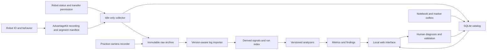

# Architecture

## Components



## Process boundaries

1. **Robot program:** IO acquisition, Commands v3 behavior, logging, boot/run metadata, logged marker receipt. No transfer/hash/network worker may block the scheduler thread. Recording stays active when collecting is paused.
2. **Robot file/status adapter:** reads authoritative state and closed-file manifest; serves bounded reads. Initial transport candidate is SFTP, coupled with a fresh status channel. A stronger future service can enforce permission at the sender as well. This is a separate concern from AdvantageKit logging.
3. **Collector on team computer:** one owner per robot/archive, fresh-status gate, persistent download checkpoints, verification queue, retry scheduling. Status handling must remain responsive while reads are pending.
4. **Hub/catalog service:** owns migrations, notes, search, API, operation history, and local UI. Prototype hosts this together with the collector. Production workers communicate through jobs/events, not long-held UI locks.
5. **Analysis worker:** reads verified artifacts, imports signals, derives run intervals, and executes versioned analyzers. Can be CPU-intensive; must not contend with the DS during driving. Pause/throttle it on a DS laptop, or run it on the practice PC.
6. **Recorder:** independently records local practice video and timing metadata. Never route camera footage through the robot radio. Recording must not depend on successful log transfer.
7. **Backup worker:** replicates verified originals and catalog exports to a second failure domain when configured/reachable. Cloud use is optional; no internet dependency for practice.

## Recommended progression

- Development: one laptop, loopback UI, synthetic source, SQLite, ignored `data/`.
- Bench: collector on a laptop, tethered robot, small real recordings; video optional.
- Practice: collector near the robot network, analysis/recording on a practice computer if DS resource contention is measurable.
- Event: portable collector, offline archive and notebook; recording/network behavior separately checked against that event's requirements. Do not assume the practice network topology is permitted or available.

Only one collector owns a given robot's download queue. If multiple laptops can see the robot, designate one; do not begin with a distributed leader election system. A process ownership lock prevents two local instances from touching the same partial files. Multiple archive readers are allowed.

## Storage layout (target)

```text
data/
  catalog.sqlite3
  partial/<source_id>/<segment_id>.part
  raw/<robot_id>/<boot_id>/<segment_id>.wpilog
  quarantine/<artifact_id>/...
  video/<session_id>/<camera_id>/<clip_id>.<container>
  derived/<source_hash>/<importer_version>/...
  reports/<analysis_run_id>/...
  exports/catalog-backups/...
  diagnostics/...
```

Names above are generated from validated identities; never concatenate arbitrary robot paths or note text into local filenames. Original robot filename is metadata. Archive paths never change merely because the robot renames a file.

Store raw binary WPILOGs and video as files. SQLite holds identities, intervals, statuses, notes, findings, and provenance. Derived columnar signals may use Parquet when the importer milestone warrants that dependency. Do not place every 250 Hz sample into normalized SQLite rows by default. CSV is an interchange/export format, not the canonical source.

Use schema migrations and transactional writes. Raw artifacts are immutable after verification; corrected labels, notes, clock mappings, and analyzer outputs are new revisions. Historical results remain inspectable. Database backup uses SQLite's backup API or a quiesced checkpointed copy, not a blind copy of the main file while WAL writes continue.

## Ingestion lifecycle

`discovered -> downloading -> downloaded_unverified -> integrity_verified -> format_validated -> indexed -> analyzed`

`backed_up` is an independent property. Transport integrity does not prove WPILOG validity. File validity does not prove all sensors were recorded. Analyzed does not mean healthy. A checksum failure goes to quarantine and does not become a valid original.

Durably store local bytes before advancing the transfer checkpoint. An analysis job uses immutable source hashes and analyzer versions as its idempotency key. The absence of an analyzer result is visible as pending/unsupported/insufficient data.

## User workflow

At start of practice, select/create a session and confirm robot identity, battery, and configuration. Collection, recording, and time-health indicators should work automatically. Each enabled interval becomes a run. Drivers mark events without needing to type; notes can be added later. Reports appear after the necessary evidence arrives. Reviewers label findings and link repair/build changes. A short standard test before/after repair closes the loop.

Continue capturing normal runs and disabled activity even if no one created a session; put them in an unassigned session group and permit later assignment. A robot may reboot mid-session; boot and session identities must remain distinct.

## Dependencies and deployment

Prototype: Python standard library and static HTML. Production defaults: Python service, SQLite, small browser frontend, SFTP adapter behind an interface, version-compatible log reader, optional FFmpeg/OBS integration. Select exact libraries at the corresponding task after checking Python/Alpha 7 compatibility. Freeze and test dependencies; record version information in diagnostic bundles.

Install a supported foreground CLI first; service/autostart packaging comes after recovery and single-instance behavior. Logs should rotate locally, contain no passwords, and expose actionable errors to the UI. Never silently swallow a crashed worker. The service must be stoppable without losing its committed checkpoint.
